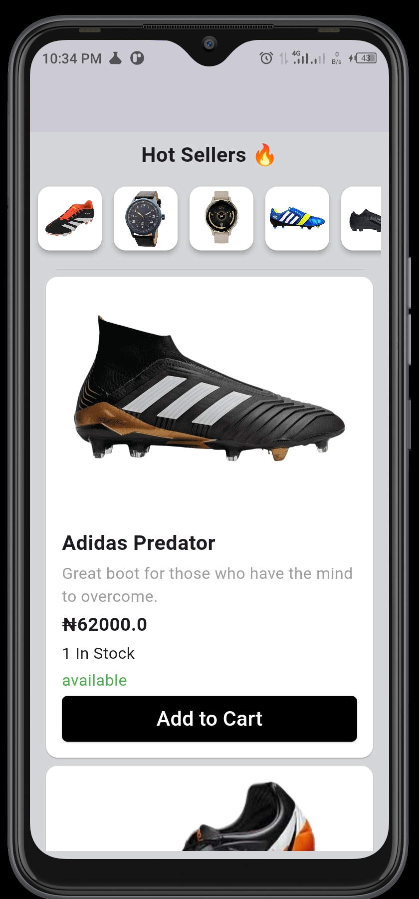
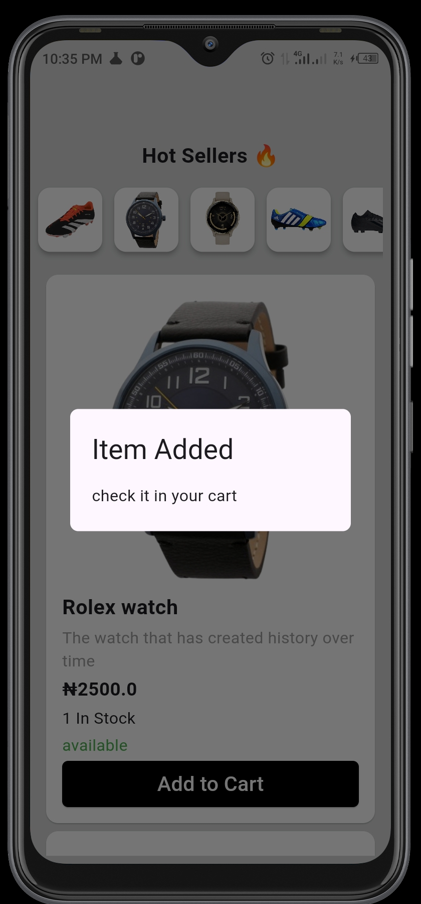

# shopat: HNG11 Task 2

This project is a project to retrieve data from [timbu.cloud](https://timbu.cloud) API and display them on a screen. This API requires you have an APIkey, and some other credentials like organization id, and app id, before you can perform some actions on it.

## How To Run

Make sure you have Flutter set up on your computer.

You can then clone the repository with the command bellow:

`git clone https://github.com/orihac/shopat.git`

The change directory to the cloned project's directory using:

`cd shopat/`

When you are in the directory use the below code to run the app.

`flutter run -d <preferred device type>`

## Installation
For you to run the app on a physical device, you can download the applicatio the link below:

[Please Download here](https://drive.google.com/drive/folders/1LWRW6niKgF0PF9DiS0kIJSP9l7CCDhJ5?usp=sharing)

When you are done downloading, click the shopat.apk file, follow the prompts and install.

You can demo the app on appetize.io when you follow the below link.

[Demo on Apetize.io here](https://appetize.io/app/android/com.example.shopat?device=pixel7&osVersion=13.0)

# About the App
The application is about getting data supplied to [timbu.cloud](https://timbu.cloud), from an API to the frontend of the application.

When you want to get a list of items, you make a `GET` call to the endpoint `/products`. Which provides list of products data like,images, product price, availability of product, and some other data like category.

To get only one item, you can make a `GET` request call to the endpoint `/products/{product_id}` where `product_id` is required.

The Timbu platform can help sellers to put out their products out there easily, and help the developer have an easy implementation of an e-commerce app across different platforms.

### Images of the App

some of the App's images are seen below.

 

